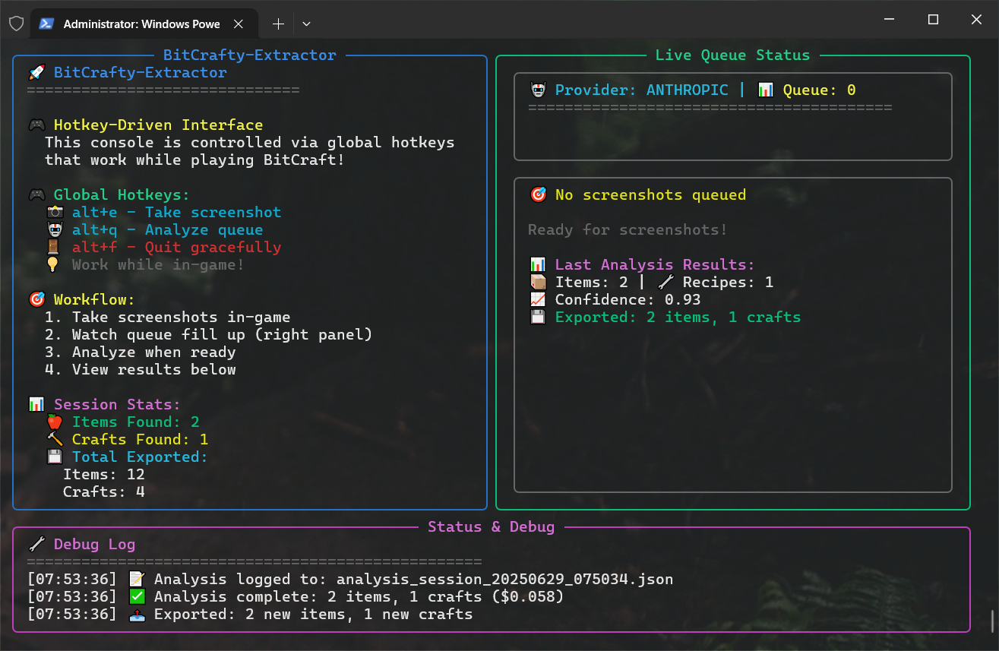

# BitCrafty-Extractor

AI-powered tool that extracts game data from BitCraft with 95%+ accuracy using GPT-4 Vision and Claude 3. Features global hotkeys, queue-based screenshot analysis, and automatic export to BitCrafty format.

## Quick Start (Barebones Machine)

### Prerequisites
- Windows 10+ (required for game window capture)
- Python 3.11+ ([Download Python](https://www.python.org/downloads/))
- Git ([Download Git](https://git-scm.com/downloads))
- OpenAI or Anthropic API key

### Installation
```powershell
# 1. Clone repository
git clone https://github.com/Kyzael/BitCrafty-Extractor.git
cd BitCrafty-Extractor

# 2. Create virtual environment
python -m venv venv
venv\Scripts\activate

# 3. Install dependencies
pip install -r requirements.txt
pip install -e .

# 4. Run application
bitcrafty-extractor
```

### First Run Setup
1. Application will prompt for API keys:
   - **OpenAI**: Get from [platform.openai.com](https://platform.openai.com/api-keys)
   - **Anthropic**: Get from [console.anthropic.com](https://console.anthropic.com/)
2. Choose primary provider (/test/ai_analysis/test_provider_comparison.py)
================================================================================
🏆 Provider Performance Ranking
================================================================================
Provider                  Status   Confidence  Cost     Time   Validation
--------------------------------------------------------------------------------
Anthropic Claude 3 Haiku  ✅ PASS   0.80        $0.0555  4.6s   ✅ PASS
Anthropic Claude 3.5 Sonnet ✅ PASS   0.80        $0.0555  8.3s   ✅ PASS
OpenAI GPT-4 Turbo        ✅ PASS   0.80        $0.0694  11.8s  ✅ PASS
OpenAI GPT-4o             ✅ PASS   0.80        $0.0694  7.6s   ✅ PASS
================================================================================
🏆 Best Provider: Anthropic Claude 3 Haiku ($0.0555, 4.6s)
3. Configure hotkeys (defaults work for most users)

### Usage
- **📸 Alt+E**: Screenshot → Queue
- **🤖 Alt+Q**: Analyze Queue → Extract Data
- **🚪 Ctrl+Z**: Quit Application

## Key Features

- **🎯 Queue-Based Workflow**: Capture multiple screenshots, analyze in batch
- **⌨️ Global Hotkeys**: Work while playing - no alt-tabbing
- **🤖 AI-Powered**: 95%+ accuracy with GPT-4 Vision and Claude 3
- **💾 Auto-Export**: Saves to BitCrafty-compatible JSON format
- **📊 Live Interface**: Three-pane console with real-time statistics
- **💰 Cost Efficient**: ~$0.008-0.03 per extraction with optimization

## How It Works

The BitCrafty-Extractor uses a streamlined workflow to capture and analyze game data:

### 1. Application Launch

*The console application starts with a clean three-pane interface showing commands, queue status, and debug information.*

### 2. Screenshot Queuing

*Press `Alt+E` while in-game to capture screenshots. The queue panel shows captured images ready for analysis.*

### 3. AI Processing

*Press `Alt+Q` to trigger batch AI analysis. The interface shows real-time processing status and cost estimates.*

### 4. AI Response

*AI providers (GPT-4V/Claude) analyze screenshots and return structured data with confidence scores.*

### 5. Export Results 

*Processed data is automatically exported to JSON files and displayed with validation status.*

### Workflow Summary
```
Main Application Workflow:
┌─────────────────┐    ┌─────────────────┐    ┌─────────────────┐
│   Hotkey Press  │ -> │  Screenshot     │ -> │   Queue         │
│   (In-Game)     │    │  Capture        │    │   Management    │
└─────────────────┘    └─────────────────┘    └─────────────────┘
                                                        │
┌─────────────────┐    ┌─────────────────┐    ┌─────────────────┐
│   Live Display  │ <- │  AI Analysis    │ <- │  Batch Analysis │
│   (Console UI)  │    │  (GPT-4V/Claude)│    │  Trigger        │
└─────────────────┘    └─────────────────┘    └─────────────────┘
```

## Configuration

Edit `~/.bitcrafty-extractor/config.yaml`:

```yaml
ai:
  openai:
    api_key: "your-openai-key"
    model: "gpt-4o"
  anthropic:
    api_key: "your-anthropic-key"
    model: "claude-3-5-sonnet-20241022"

hotkeys:
  queue_screenshot: "alt+e"
  analyze_queue: "alt+q"
  
capture:
  queue_max_size: 20
  image_quality: 85
```

## Output Format

Files are saved to `/exports/` with metadata and deduplication:

### Items (`/exports/items.json`)
```json
{
  "metadata": {
    "version": "1.0",
    "source": "bitcrafty-extractor",
    "last_updated": "2025-06-29T00:17:52.307773",
    "total_items": 1
  },
  "items": [
    {
      "name": "Rough Spool of Thread",
      "description": "A spool of thread made from fibers. Can be used to make cloth strips.",
      "rarity": "common",
      "tier": 1,
      "confidence": 0.95,
      "extracted_at": "2025-06-29T00:17:52.307773",
      "extraction_source": "bitcrafty-extractor",
      "id": "a35913a3624f"
    }
  ]
}
```

### Crafts (`/exports/crafts.json`)
```json
{
  "metadata": {
    "version": "1.0",
    "source": "bitcrafty-extractor", 
    "last_updated": "2025-06-29T00:17:52.308775",
    "total_crafts": 1
  },
  "crafts": [
    {
      "name": "Weave Rough Cloth Strip",
      "requirements": {
        "profession": "tailoring",
        "building": null,
        "tool": "basic-loom"
      },
      "materials": [
        {
          "item": "Rough Spool of Thread",
          "qty": 1
        }
      ],
      "outputs": [
        {
          "item": "Rough Cloth Strip",
          "qty": 1
        }
      ],
      "confidence": 0.9,
      "extracted_at": "2025-06-29T00:17:52.307773",
      "extraction_source": "bitcrafty-extractor",
      "id": "afb8f0c2a6bc"
    }
  ]
}
```

## Troubleshooting

**Game window not found**: Ensure BitCraft is running and visible  
**API key errors**: Verify key validity and account credits  
**Hotkeys not working**: Check for conflicts with other applications  
**Low confidence**: Ensure clear, unobscured game UI screenshots  
**Queue issues**: Check queue size limit (default: 20 screenshots)

Enable debug mode: Set `log_level: "DEBUG"` in config file.

## Development Status

### ✅ Phase 1: Core Infrastructure (COMPLETE)
- Window capture system with BitCraft process detection
- Global hotkey handling (queue and analyze)
- AI vision client with fallback providers  
- Structured prompt system for queue analysis
- YAML-based configuration management

### ✅ Phase 2: Enhanced Features (95% COMPLETE)
- Screenshot queue management system
- Data validation and confidence scoring
- Export to BitCrafty format (items.json and crafts.json)
- Advanced configuration options
- Queue size limits and management
- Missing: Visual/audio feedback for queue operations

### 🚧 Phase 3: Advanced Integration (PLANNED)
- Direct BitCrafty integration
- Auto-update existing item and craft data
- Smart duplicate detection in queue
- Batch export optimization
- Performance optimization for large queues

## License

MIT License - see [LICENSE](LICENSE) for details.

**Note**: This tool is for legitimate game data extraction and research. Please respect BitCraft's Terms of Service.
